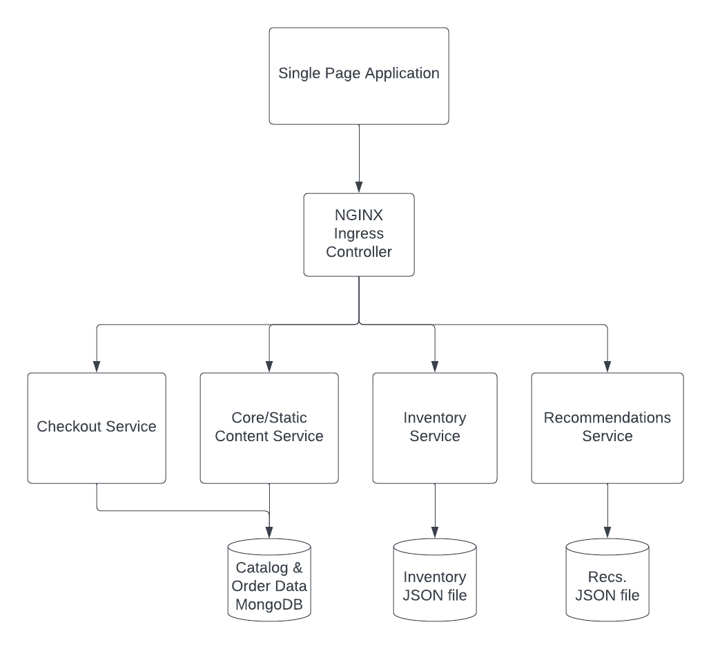

# Brewz Application

Brewz is an e-commerce beverage company whose microservices-based application has been designed to deploy into Kubernetes. Deploying this application into Kubernetes allows them to scale this application locally (in the same cluster) for reliability and capacity, as well as scale globally to multiple locations based on customer demand.

This is a simple diagram depicting the design of the Brewz application and its microservices:



## Deploying the Brewz Application

Now that we have a working platform with essential infrastructure applications installed, you as application developer can deploy the Brewz application.

Since the application developers are *also* committed to GitOps, we'll deploy the Brewz application in a similar way to what we've done so far. The Brewz application code is already in Git, so developers are already comfortable with it. It is reasonable for them to also rely on Git for the application's deployment artifacts, and enjoy the benefit of ArgoCD handling deployments for them.

Though ArgoCD deployed the infrastructure applications with Helm, the developers have chosen to deploy this application using simple Kubernetes manifests.

> **Note:** Though we are using a single repository in this lab, it is a good practice to use different repositories for infrastructure apps and user applications (such as Brewz). This way, appropriate access to each repo is granted based on area of responsibility.

Let's deploy the Brewz application.

1. Deploy Brewz by running the following command in the Visual Studio Code terminal:

    ```shell
    kubectl apply -f manifests/brewz-application.yaml
    ```

## Verify the Deployment

1. Verify the installation was successful by opening the ArgoCD tab in your browser. Ensure that an application called `brewz` has been installed, and is in sync and healthy.

1. In your browser, open a new tab and enter `https://brewz-<your namespace>.labs.f5demos.com` to see the Brewz application is live.

1. In your browser, open a new tab and navigate to the XC console at `https://f5-sales-demo.console.ves.volterra.io/` and log in if prompted.

1. Navigate to **Multi-Cloud App Connect**. Ensure your namespace is selected in the top of the left menu.

1. Click *Manage -> Load Balancers -> HTTP Load Balancers*

1. Note the Load Balancers that have been created for the infrastructure applications that were installed earlier for you (`argocd` and `grafana`), as well as for the Brewz application that was just installed.

## Examining the Brewz Application

Now that the application has been deployed, examine the applications's deployment manifests.

1. Locate the `manifests/brewz` folder in Visual Studio Code.

1. The `app.yaml` file contains the application's `Deployment` and `Service` resources to install the applications pods and expose them.

1. The `mongo-init.yaml` file contains a `ConfigMap` resource containing the JSON data used to seed the MongoDB database.

1. The `xc-ingress.yaml` file contains an `Ingress` resource with custom annotations. The XC Ingress Controller monitors the cluster for these resources. When this type of resource is deployed, the XC Ingress controller will use the `Ingress` resource details and annotations to:
    - Create an XC Origin pool that points to the NGINX Ingress Controller's service on port 443 in the specified App Stack site
    - Create an XC HTTP Load Balancer for the host name `https://brewz-<your namespace>.labs.f5demos.com`, responding on an existing Public IP available in this tenant
    - Creates a single XC Load Balancer Route for the path `/` set to the Origin Pool created above
    - Sets the Load Balancer to preserve the host name when routing traffic to the NGINX Ingress Controller Service

    <br>

    > **Note:** There are comments in the file indicating which groups of annotations are associated with each XC object created above.

    How does traffic get to our application?

1. Open the `virtual-server.yaml` file. This file contains a `VirtualServer` custom resource that NGINX Ingress Controller will consume to secure, route and shape our traffic destined for the Brewz application. Thanks to the `VirtualServer`'s `host` field, NGINX Ingress Controller will accept and route traffic associated with this host name from the XC Load Balancer to the appropriate services. We will examine the `VirtualServer` and `VirtualServerRoute` resources in detail next in this lab.

1. The remaining manifests are `Policy` resources to provide rate limiting and JWT authorization services to Brewz microservices.

## Examine NGINX Dashboard in Grafana

1. In your browser, open the tab where **Grafana** is running.

1. Select the **NGINX Plus Ingress Controller** dashboard from the Grafana **Dashboards** menu. The dashboard should appear. Expand all the sections so you see similar to the following:

    

1. By default, this dashboard does not automatically refresh. Click the refresh icon in the upper right of the screen and set the refresh value to 10 seconds.

    

1. In your browser, open the tab where **Brewz** application is, and exercise various functions of the application.

1. Return to the Grafana dashboard tab. You should start to see **Ingress Metrics** such as **Success Rates Over Time** and **Upstream Success Rate** charts start to trend upward. This is a good indication that both NGINX Ingress Controller and the Brewz application are operating correctly.

[Continue to next section...](virtualserver.md)
