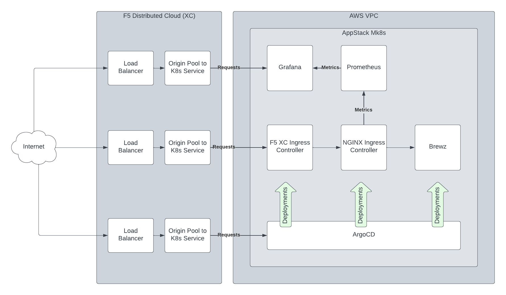
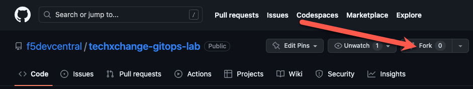
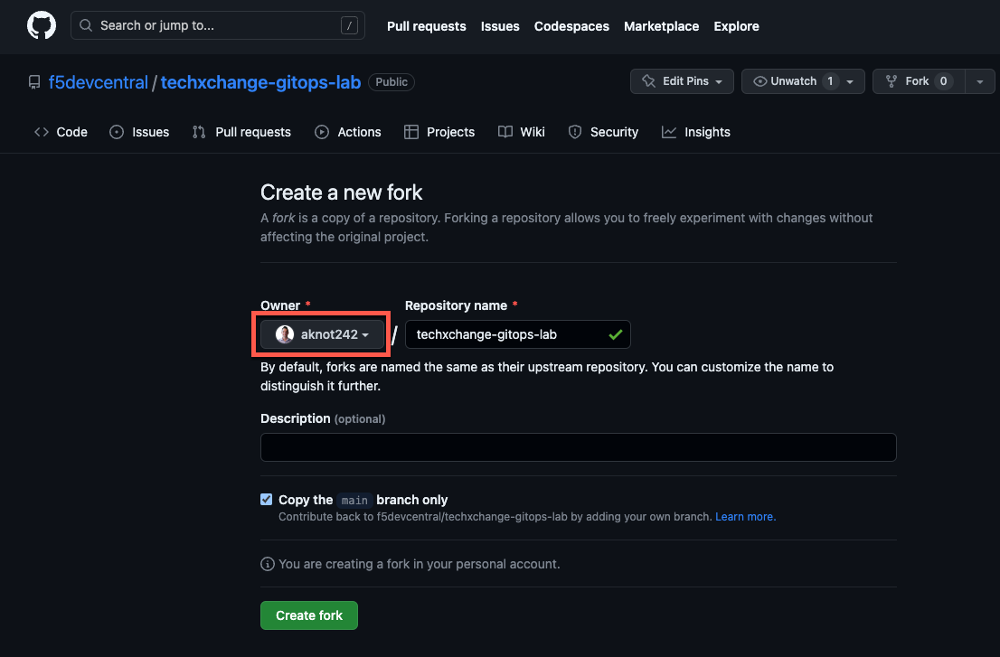
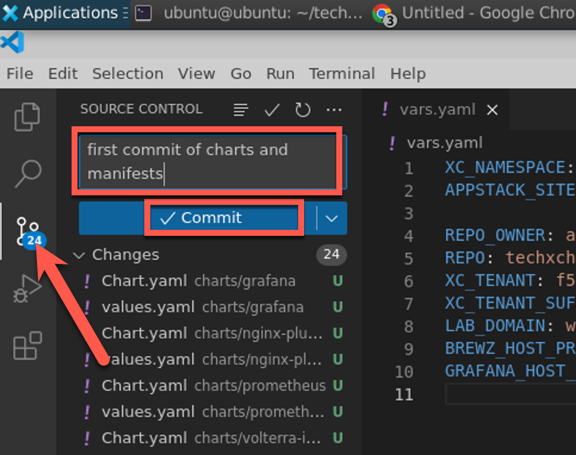
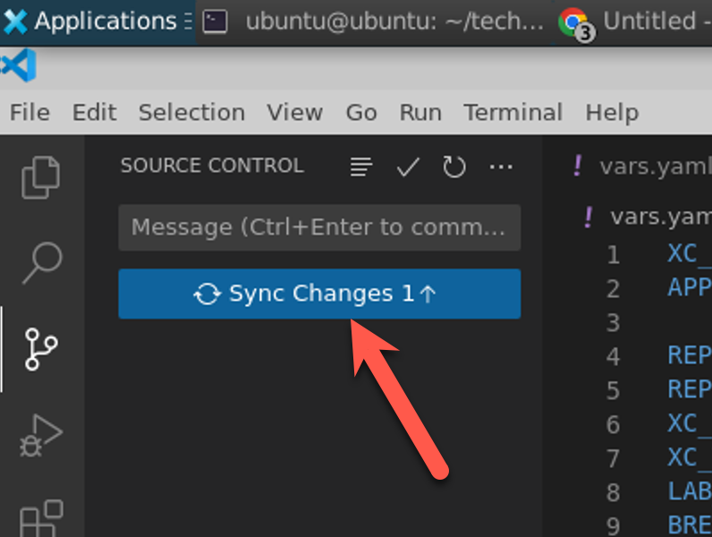

# Lab Introduction

The objective of this lab is to demonstrate the deployment of an application into a Managed Kubernetes instance running on an AppStack Customer Edge (CE). We will deploy the F5 Distributed Cloud (XC) Ingress Controller to route traffic from the internet to an application, and NGINX Ingress Controller to provide granular routing capabilities to this application.

As an ideal, application code should be versioned and maintained in s secure Source Control Management (SCM) repository, such as Git. However, what about the configuration, management and governance of infrastructure?

## GitOps

GitOps is an operational framework that takes DevOps best practices used for application development such as version control, collaboration, compliance, and CI/CD, and applies them to infrastructure automation.

We will be practicing GitOps for Continuous Deployment of our applications. Argo CD is the tool we will be using to watch your lab repository for changes, and automatically deploy updated resources to Kubernetes for you.

## Lab Architecture

Upon first starting the lab, an XC AppStack Managed K8s cluster has been deployed for you in an AWS VPC. An namespace for you to deploy application into has been created, and the ArgoCD application has been installed for you.

Upon successful completion of this lab, the following components will have been deployed by you with the help of ArgoCD:

- Grafana and Prometheus for metrics collection and analytics dashboards
- An F5 XC Load Balancer for the Grafana UI
- XC Ingress Controller for creation of Load Balancers & Origin Pools for service connectivity
- NGINX Ingress Controller for advanced traffic routing
- A microservices application called "Brewz", complete with XC Load Balancers & Origin Pools for service connectivity



## Getting Started

## Deploy the TechXchange GitOps UDF Blueprint

TODO: Need final link for BP

1. Open the TechXchange GitOps Lab UDF Blueprint and deploy it in the region geographically closest to you. Start the deployment with the default suggested resource settings.

## Log into the **devbox** VM in the UDF Deployment


1. If the **devbox** component is not running, start it now.

1. Select the **xRDP** access method in this component.

1. Once the RDP file downloads, open it with your Remote Desktop client of choice, usually by double-clicking on the downloaded file.

1. When prompted to login, use the credentials that are shown in the **Documentation** tab of the **devbox** UDF component.

## Trigger build of lab environment

1. Open a terminal and run the following command to switch to the infrastructure branch we will use for this lab:

    ```bash
    cd ~/terraform-modular-demo-framework && git checkout gitops-lab-merge
    ```

1. TODO: walk student through starting terragrunt apply all

## Fork the lab repository

1. On your desktop (not the lab VM), you will need to fork the lab repository to your GitHub account. If this is your first time, then take a few minutes to review the [GitHub Docs on how to Fork a repo](https://docs.github.com/en/get-started/quickstart/fork-a-repo).

    You can complete this task through the [repository GitHub UI](https://github.com/f5devcentral/techxchange-gitops-lab):

    

    Note: If you are a member of any GitHub organizations, be sure to select **yourself** as the owner, and not an organization (such as `f5devcentral` or `nginxinc`):

    


1. In Visual Studio Code in the **devbox** VM, click **File -> New Window**

1. Click the **Terminal -> New Terminal** menu item to open a bash shell session if one is not already open at the bottom of the window.

## Configure GitHub authentication

Later in this lab, you will require GitHub authentication to push commits back to your forked repo.

1. Log into GitHub using the `gh` CLI:

    ```bash
    gh auth login -h github.com -p https -w
    ```

1. Type "Y" and enter when prompted to "Authenticate Git with your GitHub credentials?"

    Note: an authorization code will be shown. Copy this for use later.

1. Press **Enter** to open the browser.

1. Enter your GitHub username, then password.

1. Enter the authorization code when prompted

1. Click the **Authorize github** button on the next screen

## Clone your workshop repository

We will now clone your forked copy of the workshop repository to your lab workstation.

1. In Visual Studio Code, configure your Git name and email by entering the following into the terminal window. These will be used for Git commit logs:

    ```bash
    git config --global user.email "<your work email address>"
    git config --global user.name "<your full name>"
    ```

1. Clone your repository via the git command:

    > **Note:** Make sure to replace `your github user name` with your GitHub username.

    ```bash
    cd ~
    export GITHUB_USER=<your github user name>
    git clone https://github.com/$GITHUB_USER/techxchange-gitops-lab.git

    ```

1. Click **File -> Open Folder** and select the `techxchange-gitops-lab` folder that was just created from the command above.

## Set up your lab environment

1. Click the **Terminal -> New Terminal** menu item to open a bash shell session if one is not already open at the bottom of the window.

1. Run the following command in the terminal window to generate the Kubernetes manifests you will be using in this lab:

    ```shell
    export GITHUB_USER=<your github user name>
    gomplate -t gomplate-templates.tmpl
    ```

1. Using the Source Control pane, stage and commit the entire contents of the `charts` and `manifests` folders that were just created for you.

    

1. Push the changes to your origin repository.

    

1. You may see several prompts in a row:

    - If prompted "This action will push and pull...", click the **Ok** button.

    - If prompted by "The extension 'GitHub' wants to sign in using GitHub", click the **Open xdg-button** button and follow the prompts

    - If prompted with "Allow an extension to open this URI?", click the **Open** button.

    - If prompted to "Unlock Login Keyring", enter the password you used to connect to this Ubuntu workstation, and click the **Unlock** button.

1. Open a browser to your repository and verify that your changes were successfully pushed to your GitHub repo:

    ```shell
    google-chrome https://github.com/$GITHUB_USER/techxchange-gitops-lab.git
    ```

## Test AppStack Managed Kubernetes with Kubeconfig

To test interactions with the AppStack Kubernetes cluster, you will use the `kubeconfig`. A kubeconfig configuration file has already been provided for you on the **devbox** vm.

1. In the Visual Studio Code terminal window, use `kubectl` to test your new configuration:

    ```bash
    kubectl get nodes
    ```

    You should see the Kubernetes node in an output similar to this:

    ```shell
    NAME                                        STATUS   ROLES        AGE   VERSION
    ip-100-64-1-16.us-east-2.compute.internal   Ready    ves-master   86m   v1.23.14-ves
    ```

    Your Managed Kubernetes cluster is now ready to accept configuration.

[Continue to next step...](argocd.md)
