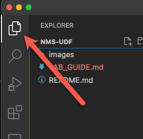

# VirtualServer and VirtualServerRoute Resources

Like XC Ingress Controller, NGINX Ingress Controller can consume `Ingress` resources. However, to overcome the limitations of the `Ingress` resource's API without resorting to error-prone annotations, new Custom Resource definitions were created to ease traffic configuration and unlock additional functionality.

VirtualServer and VirtualServerRoute resources were added into NGINX Ingress Controller starting in version 1.5 and are implemented via [Custom Resources (CRDs)](https://kubernetes.io/docs/concepts/extend-kubernetes/api-extension/custom-resources/).

The resources enable use cases not supported with the Ingress resource, such as traffic splitting and advanced content-based routing.

More detailed information can be found in the [VirtualServer and VirtualServerRoute Resources docs](https://docs.nginx.com/nginx-ingress-controller/configuration/virtualserver-and-virtualserverroute-resources).

Let's take a look at common resources for a modern application.

You can reference your `virtual-server.yaml` as you read through this part of the lesson, or simply refer to the appropriate yaml snippets provided below.

  > ***Note:*** To see your files in Visual Studio code, ensure the **File Explorer** button is selected:

  

<br/>

## Action

The action resource defines an action to perform for a request and is the basis for our Brewz demo application.

### Pass

The *pass* action passes the request to an upstream that is defined in the resource.

In the Brewz `virtual-server.yaml` manifest, the *spa* and *api* services leverage this method.

```yaml
...
  upstreams:
    - name: spa
      service: spa
      port: 80
    - name: api
      service: api
      port: 8000
...
  routes:
    - path: /
      action:
        pass: spa
    - path: /api
      action:
        pass: api
...
```

### Redirect

The *redirect* action redirects a request to a provided URL.

### Return

The *return* action returns a preconfigured response.

### Proxy

The *proxy* action passes a request to an upstream with the ability to modify the request/response.

In the Brewz `virtual-server.yaml` manifest, the */images* path uses this method to proxy requests to the api service's */images* path.

```yaml
...
    - path: /images
      action:
        proxy:
          upstream: api
          rewritePath: /images
...
```

## Upstreams

The upstream defines a destination for the routing configuration. The upstream's name must be a valid DNS label as defined in RFC 1035.

In the Brewz `virtual-server.yaml` manifest, we define a very simple upstream configuration for the *spa* and *api* services:

```yaml
...
  upstreams:
    - name: spa
      service: spa
      port: 80
    - name: api
      service: api
      port: 8000
...
```

While this configuration meets our requirements for a lab, in a production environment you may need more advanced configurations.  For example, if we knew that the core API service could only handle 32 concurrent connections then we may want to modify the manifest to include the *max-conns* attribute:

```yaml
...
  upstreams:
    - name: spa
      service: spa
      port: 80
    - name: api
      service: api
      port: 8000
      max-conns: 32
...
```

For a full list of Upstream attributes, please refer to the [docs](https://docs.nginx.com/nginx-ingress-controller/configuration/virtualserver-and-virtualserverroute-resources/#upstream).

### HealthCheck

One of the advantages the NGINX Plus Ingress Controller provides is the ability to perform health checks on your upstreams. This can be very useful in situations like the Brewz API which is dependent on a MongoDB database to function correctly.  By checking the APIs' custom /stats API, we can determine if the API server is functioning correctly.

1. In your `virtual-server.yaml` file, note the `healthCheck` resource associated to the `api` service upstream:

    ```yaml
    ...
      upstreams:
        - name: api
          service: api
          port: 8000
          healthCheck:
            enable: true
            path: /api/stats
            interval: 20s
            jitter: 3s
            port: 8000
    ...
    ```

## ErrorPage

The Brewz developers have an issue where their APIs are not always returning a JSON response. A good example is when you lookup a product that does not exist. The API returns a 400 HTTP response code but the body payload is *"Could not find the product!"*.

1. Run the following command from a terminal in the **devbox** vm to test this output:

    ```bash
    export BREWZ_URL=<your brewz application url without the path>
    curl $BREWZ_URL/api/products/1234
    ```

    Ideally, the development team will fix this issue in the API code but we can also help by performing a quick fix via our VirtualServer configuration.

1. In VSCode, open the `manifests/brewz/virtual-server.yaml` file and add an `errorPages` resource to the `routes` -> `/api` path; example below.

    ```yaml
    ...
        - path: /api
          policies:
            - name: rate-limit-policy
          action:
            pass: api
          errorPages:
            - codes: [404]
              return:
                code: 404
                type: application/json
                body: |
                  {\"msg\": \"Could not find the resource!\"}
                headers:
                  - name: x-debug-original-status
                    value: ${upstream_status}
    ...
    ```

1. Commit the `manifests/brewz/virtual-server.yaml` file to your local repository, then push it to your remote repository. ArgoCD will pick up the most recent changes, and deploy them for you.

    > **Note:** In the lab environment, at times ArgoCD may not immediately detect and deploy the changes. If this is the case, click the **Refresh** button on the **brewz** application in ArgoCD.

1. Now, check that an unknown product returns a JSON object by running the following command in the terminal of the **devbox** vm:

    ```bash
    curl $BREWZ_URL/api/products/1234
    ```

    > Your output should look like: `{"msg": "Could not find the resource!"}`

## Next Steps

Next, you will [look at the A/B Testing deployment pattern](ab-testing.md) and how to implement it with NGINX Ingress Controller.

<!-- Next, you will [look at the Canary deployment pattern](canary.md) and how to implement it with NGINX Ingress Controller. -->
